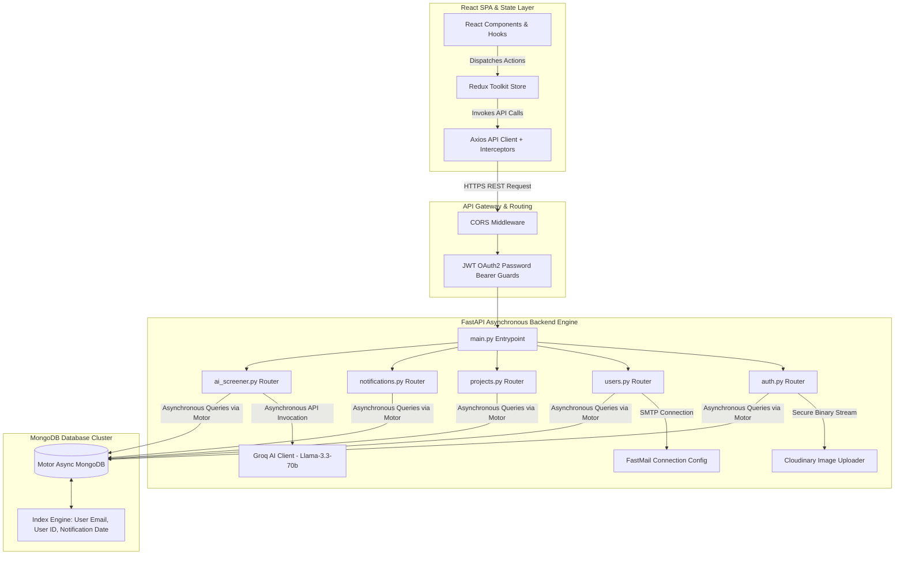
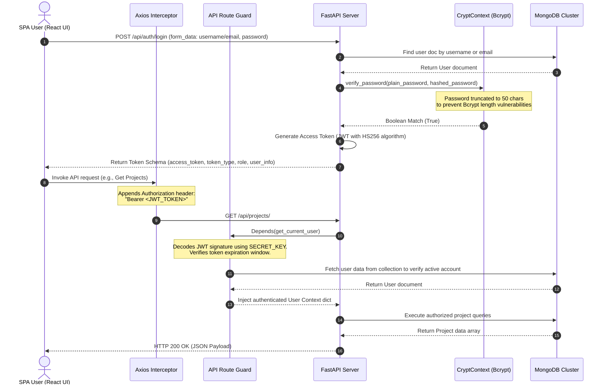

# OfficeOS: Next-Generation Professional Workspace & AI-Powered HR Ecosystem
## Comprehensive Architectural & System Design Report

---

## 1. Executive Summary & Product Vision

**OfficeOS** is an advanced, high-fidelity corporate management platform engineered to unify project coordination, team communications, and smart talent acquisition under a single, cohesive ecosystem. Designed to replace fragmented workflows involving email, task-tracking boards, and separate recruitment tools, OfficeOS serves as a unified digital workspace. 

The application is structured around two distinct operational experiences:
1. **The HR Administrator Portal**: A premium, high-density control center designed for managing organization configurations, conducting CSV-based employee batch onboarding, establishing structural hierarchies, launching initiatives, and processing AI-assisted recruitment pipelines.
2. **The Employee Workspace**: A modern, collaboration-first dashboard that equips team leads and members with intuitive kanban boards, real-time activity metrics, automatic deadline alerts, comment threads, and structured report submissions.

---

## 2. High-Level System Architecture

OfficeOS implements a decoupled, modern **Three-Tier Architectural Pattern** featuring a high-performance Single Page Application (SPA) frontend, an asynchronous RESTful backend API service, and a non-relational document database.



### 2.1 Technology Stack Rationale
- **Frontend SPA (Vite + React 19)**: Selected for its sub-millisecond Hot Module Replacement (HMR) speeds, reactive DOM updates, component-driven modularity, and smooth single-page transition capabilities.
- **State Management (Redux Toolkit & Redux Slices)**: Enforces a single source of truth for global states (e.g., Auth, Theme, Active Workspace, and Real-Time Notifications) across deeply nested UI branches.
- **Styling (Tailwind CSS v4)**: Utilizes a post-CSS compile-time utility framework to construct a premium, fluid interface with responsive configurations, sleek dark/light mode toggles, and customized glassmorphic design variables.
- **Backend API Engine (FastAPI + Uvicorn)**: An asynchronous ASGI framework built on top of Starlette and Pydantic. It provides automatic OpenAPI document generation, high computational throughput via Python’s `async`/`await` paradigms, and strict data validation out-of-the-box.
- **Database Layer (MongoDB + Motor Async Driver)**: A schema-agnostic, non-relational document database. It is perfectly aligned with variable organization schemas, nested object comments, fast-changing notification histories, and JSON response models returned directly from AI engines.

---

## 3. Database Schema Design & Optimization

Database queries are executed asynchronously using the MongoDB **Motor** library. Document objects use internal helper maps to translate MongoDB’s native `_id` (ObjectId) strings into standard JSON client-safe string formats.

### 3.1 Data Models & Schemas

#### User Entity (`users` collection)
Stores authentication details, profile configurations, organizational metadata, and onboarding state.
```python
class User(BaseModel):
    id: str
    first_name: str
    last_name: str
    email: EmailStr
    username: Optional[str] = None
    gender: Optional[str]
    age: Optional[int]
    organization_name: Optional[str]
    contact_info: Optional[str]
    org_architecture: Optional[str]
    org_headcounts: Optional[str]
    cultural_practices: Optional[str]
    role: str # "HR" or "EMPLOYEE"
    profile_image: Optional[str] # URL path
    org_logo: Optional[str] # URL path
    created_by: Optional[str] # Reference to HR Creator User ID
    must_change_password: bool = True # Forces password change on first login
```

#### Project Entity (`projects` collection)
Holds workspace project settings, status progress tracker counters, and assignment lists.
```python
class ProjectCreate(BaseModel):
    name: str
    description: Optional[str] = None
    assigned_to: List[str] # List of employee ids
    team_lead_id: Optional[str] = None
    priority: Optional[str] = "MEDIUM" # "LOW", "MEDIUM", "HIGH"
    status: Optional[str] = "PLANNING" # "PLANNING", "ACTIVE", "COMPLETED", "ON_HOLD"
    start_date: Optional[str] = None
    end_date: Optional[str] = None
```

#### Task Entity (`tasks` collection)
Encapsulates individual operational units, sub-assignments, comment histories, and work evidence file links.
```python
class TaskCreate(BaseModel):
    project_id: str
    title: str
    description: Optional[str] = None
    type: Optional[str] = "TASK" # "TASK", "BUG", "MILESTONE"
    priority: Optional[str] = "MEDIUM"
    status: Optional[str] = "TODO" # "TODO", "IN_PROGRESS", "REVIEW", "COMPLETED"
    due_date: Optional[str] = None
    assigned_to: Optional[List[str]] = []
    comments: List[dict] = [] # Nested Schema: {text, author, author_id, timestamp}
    report_link: Optional[str] = None # File/evidence URL for completed work
```

#### Notification Entity (`notifications` collection)
Monitors context-specific event alerts.
```python
class Notification(BaseModel):
    id: Optional[str] = None
    user_id: str
    title: str
    message: str
    type: str = "info" # "info", "success", "warning", "error"
    is_read: bool = False
    created_at: datetime
    link: Optional[str] = None
```

### 3.2 Performance Tuning & Database Indexing
To preserve sub-second response times as the organizational datasets scale, OfficeOS applies database indexations on startup (`database.py`):
1. **Notification Indexes**: `[("user_id", 1), ("created_at", -1)]`
   - Ensures that user notification lists populate instantly without undergoing resource-intensive collection scans.
2. **Task Indexes**: `[("assigned_to", 1), ("status", 1)]`
   - Enables fast fetching of active dashboard tasks assigned to specific employees.
3. **Authentication Index**: `unique=True` on `email`
   - Accelerates login checks and guarantees account uniqueness across the platform.

---

## 4. End-to-End Security & Authentication

OfficeOS features a robust, role-based, zero-trust authentication sequence that protects every API request.



### 4.1 Token Storage Policies
- **Standard Login**: Tokens are saved to the client's `sessionStorage`. Closing the browser tab terminates the session, securing access on shared terminals.
- **"Remember Me" Configuration**: Checking this option during login saves the token in the client's local persistent storage (`localStorage`) and extends token validity to 30 days.

### 4.2 Security Vulnerability Defenses
- **Bcrypt Hash Constraints**: The standard Bcrypt hashing algorithm caps active inputs at 72 bytes. To prevent hashing bypasses and buffer overflow bugs, `utils.py` automatically truncates candidate passwords at 50 characters before verification or storage.
- **Forced Password Changes**: When HR imports or registers employees, temporary passwords are auto-generated. These records are flagged with `must_change_password: true`. The React Router detects this flag on login and redirects the user to the `/change-password` portal. This blocks all other dashboard page queries until a custom password is configured.

---

## 5. Backend Deep-Dive: Service Routers

The backend service is structured into focused routers located in `/routers`, keeping logic isolated and highly maintainable.

### 5.1 auth.py - Identity & Profile Registry
Manages HR initial signups, secure profile registrations, login exchanges, and visual assets processing.
- **HR Onboarding**: HR signups accept multipart form data, enabling administrators to supply personal attributes alongside binary files for their profile image and company logo.
- **Cloudinary CDN Pipeline**: Uploaded files are converted into secure streams and transmitted to Cloudinary. The cloud service returns HTTPS links, which are saved in the database user record to ensure fast media delivery.

### 5.2 users.py - Workforce Provisioning & CSV Normalization
Responsible for individual accounts creations, batch file imports, profile updates, and cascading organizational purges.
- **Batch CSV Import Engine**: The `/employee/csv` route parses uploaded batch tables via the **Pandas** library. To support arbitrary column layouts, the engine runs a robust column mapping analysis, resolving user headers using target dictionaries:
  - `first_name` mappings: `first_name`, `name`, `first`
  - `last_name` mappings: `last_name`, `surname`, `last`
  - `email` mappings: `email`, `email_address`, `mail`
  - `role` mappings: `role`, `position`, `designation`, `job_title`
- **Welcome Notification Sequence**: For each imported employee, a random 8-character password is created. Once the record is saved, a professional, templated HTML email is sent via `fastapi-mail` to provide the user with their access link and login credentials.
- **Cascade Workspace Deletion**: If an HR manager decides to delete their organization, the `/me` route executes a cascade delete:
  1. Locates all projects created by the HR ID.
  2. Permanently purges all tasks linked to those projects.
  3. Deletes all employee accounts belonging to the organization.
  4. Purges all associated project records.
  5. Deletes the core HR user record itself.

### 5.3 projects.py - Project Coordination & Task Lifecycles
Provides CRUD actions for initiatives, task boards, comments, status reviews, and assignments.
- **Automatic Progress Calculation**: Rather than requiring manual progress updates, the project's progress is calculated dynamically on fetching. The route queries all tasks linked to a project:
  $$\text{Progress} = \left(\frac{\text{Completed Tasks}}{\text{Total Tasks}}\right) \times 100$$
- **Role-Based Review Logic**: Anyone can create comments, but task completion reviews enforce strict security boundaries. If an employee completes a task, they submit a report link, moving the task to the review queue. Only the project's **Team Lead** or an **HR Administrator** can mark a task as completed. Additionally, a safeguard prevents team leads who are also assigned to a task from approving their own work, requiring a secondary review.

### 5.4 ai_screener.py - Intelligent Recruitment Screener
Implements a smart, zero-data-leak resume assessment engine powered by Groq Llama 3 models.
- **Direct File Extraction**: Accepts a job description alongside raw PDF, DOCX, or TXT resumes. Using `pypdf` and `python-docx` packages, the router extracts the document's raw text directly in-memory, avoiding the need for temporary storage.
- **Structured LLM Inference**: Extracted text is fed to a specialized Groq API interface using the `llama-3.3-70b-versatile` model. The request enforces a structured JSON output format to ensure reliable parser mapping:
  ```json
  {
      "candidate_name": "Name",
      "score": 85,
      "summary": "High-level overview...",
      "strengths": ["Strength 1", "Strength 2"],
      "weaknesses": ["Weakness 1", "Weakness 2"],
      "verdict": "HIRE / INTERVIEW / REJECT"
  }
  ```
- **Historical Analysis Cache**: Successful AI analyses are saved to the `ai_analysis` database collection, allowing HR managers to quickly search and review past recruitment runs.

### 5.5 notifications.py - Real-Time Alert Engine
A lightweight, context-aware notification engine. To keep storage footprints low, a cleanup process triggers during notification creation to ensure only the 5 most recent alerts are stored per user.
- **On-the-Fly Deadline Scanning**: Rather than running slow background cron jobs, the `/notifications/` route executes a quick date scan whenever the user loads the page:
  - Fetches all active tasks assigned to the user that have valid `due_date` fields.
  - Compares the task's due date against the current time.
  - If a task is due within 24 hours, it creates a `warning` notification ("Deadline Approaching").
  - If the task is overdue, it triggers an `error` notification ("Deadline Passed").
  - A 24-hour rate limiter prevents duplicate alerts for the same task.

---

## 6. Frontend Deep-Dive: React & Redux Architecture

The client application is organized into a clean, modular structure:
- `/services`: Raw Axios API configurations.
- `/features`: Redux slices managing global state.
- `/components`: Reusable, atomic UI components.
- `/pages`: Primary operational views.

### 6.1 Core Redux Slices
- **`authSlice.js`**: Handles authentication credentials, login/logout procedures, profile updates, and password changes.
- **`workspaceSlice.js`**: Synchronizes workspace details, active project lists, employee directories, and active task queues.
- **`themeSlice.js`**: Manages the application's global visual state (light mode vs. dark mode) and applies class tags to the document root.
- **`notificationSlice.js`**: Controls context-specific notification states, unread counters, and dropdown views.

### 6.2 Page-by-Page Feature & Component Catalog

#### A. Landing Page (`Home.jsx`)
A clean, premium, dark-themed introduction to the product, featuring smooth micro-animations.
- **Visual Design**: Sleek dark mode styling with emerald accents, animated text, and responsive feature grids.
- **Navigation Elements**:
  - `Launch Dashboard` Button: Redirects authenticated users directly to their workspace.
  - `Login` / `Register HR` Buttons: Redirects guest users to authentication flows.

#### B. Auth portals (`Login.jsx`, `SignupHR.jsx`, `ChangePassword.jsx`)
Polished, accessible forms built with built-in Pydantic validation matchers.
- **Visual Design**: Balanced, high-contrast layouts featuring soft glassmorphic panels and subtle gradients.
- **Key Interventions**:
  - `Remember Me` checkbox: Modifies global token persistence policies.
  - `CSV Batch Import File Uploader`: File dropzone equipped with drag-and-drop validation.
  - `Logo / Profile Pic Crop Panel`: Provides real-time preview options before uploading.

#### C. Central Workspace Layout (`Layout.jsx`)
The core UI shell that frames the user experience.
- **Component Parts**:
  - **Collapsible Sidebar (`Sidebar.jsx`)**: Responsive navigation menu that collapses to save space on smaller screens. Includes quick links to Team directories, Tasks, and AI Screener portals.
  - **Dynamic Navbar (`Navbar.jsx`)**: Contextual header showcasing current team logos.
  - **Interactive Notifications Bell (`NotificationBell.jsx`)**: Real-time notifications dropdown displaying unread counters and quick action links.
  - **Workspace Dropdown (`WorkspaceDropdown.jsx`)**: Workspace selector enabling users to switch between active organizations.

#### D. Core Management Dashboard (`Dashboard.jsx`)
A high-density operational center providing users with a comprehensive snapshot of active projects and tasks.
- **Key Components**:
  - **Stats Cards Grid (`StatsGrid.jsx`)**: Dynamic metrics cards showing active counts for projects, members, and completed tasks.
  - **Recent Activity Feed (`RecentActivity.jsx`)**: Live activity feed tracking project updates and milestone completions.
  - **Tasks Overview Widget (`TasksSummary.jsx`)**: Interactive tasks summary tracking personal task queues and outstanding due dates.

#### E. Projects Portfolio & Kanban Boards (`Projects.jsx`, `ProjectDetails.jsx`)
- **Key Components**:
  - **Dynamic Project Cards (`ProjectCard.jsx`)**: Showcases individual projects with status badges, priority highlights, and automatic progress bars.
  - **Create Project Modal (`CreateProjectDialog.jsx`)**: HR wizard for configuring projects, setting dates, assigning Team Leads, and selecting team members.
  - **Analytics Panel (`ProjectAnalytics.jsx`)**: Rich data visualizations powered by **Recharts**, tracking task burn-down curves, team capacity, and overall task distributions.
  - **Interactive Project Tasks Board (`ProjectTasks.jsx`)**: Drag-and-drop Kanban board enabling quick task status updates.
  - **Project Calendar Interface (`ProjectCalendar.jsx`)**: Interactive monthly calendar tracking task deadlines and project milestones.

#### F. AI Recruiter Screener Command Center (`AIScreener.jsx`)
An intuitive recruitment dashboard for assessing job candidates.
- **Interactive Controls**:
  - **Job Requirements Dropzone**: Large text area for paste-in requirements.
  - **Resume Drag-and-Drop Area**: File selector accepting batch uploads of PDFs, Word files, and text documents.
  - **Analysis Progress Indicator**: Modern progress bar showing live upload and assessment status.
  - **Interactive Candidates Table**: Dynamic data table featuring score badges, hire verdicts, and click-to-open summary modals.

---

## 7. Operational Workflow Demonstrations

### 7.1 Employee Batch Onboarding
```
[HR Prepared CSV File] ──> [Uploads via /users/employee/csv]
                                │
                                ▼
             [Pandas Normalizes Headers & Aliases]
                                │
                                ▼
          [Loops Through Rows & Checks for Existing Emails]
             ├── (If Email Exists) ──> Record Skipped
             └── (If New Email)    ──> Generate 8-Char Password
                                           │
                                           ▼
                                 [Hash & Save to DB]
                                           │
                                           ▼
                                [Send Onboarding Email]
```

### 7.2 Task Lifecycle & Evidence Approval
```
[Team Lead Creates Task] ──> [Assigned Employee Receives Alert]
                                       │
                                       ▼
                         [Employee Works & Updates Status]
                                       │
                                       ▼
                       [Employee Uploads Report Link]
                        (Task moves to REVIEW status)
                                       │
                                       ▼
                     [HR / Team Lead Reviews Submission]
                     ├── Reject ──> Return to IN_PROGRESS
                     └── Approve ──> Update status to COMPLETED
                                    (Recipients notified)
```

---

## 8. Development Status & Roadmap

OfficeOS features a solid foundational architecture, robust security, and reliable AI-assisted assessment features.

```
┌────────────────────────────────────────────────────────┐
│                   COMPLETED BASELINE                   │
├──────────────────────────┬─────────────────────────────┤
│ • Secure JWT & Bcrypt    │ • Dynamic Kanban Boards     │
│ • Motor Async DB Queries │ • AI Resume Screening       │
│ • Fuzzy CSV Onboarding   │ • Real-time Task Calendars  │
└──────────────────────────┴─────────────────────────────┘
                                │
                                ▼
┌────────────────────────────────────────────────────────┐
│                     UPCOMING SCOPE                     │
├──────────────────────────┬─────────────────────────────┤
│ • WebSockets Chat        │ • Advanced HR Time Tracking │
│ • Multi-tenant Sharding  │ • PDF Onboarding Packets    │
└──────────────────────────┴─────────────────────────────┘
```

- **Phase 1: Real-Time Collaboration**: Deploying dynamic, bi-directional WebSockets channels to support instant messaging and live project status updates.
- **Phase 2: Enterprise Scaling**: Transitioning the database architecture to support multi-tenant horizontal sharding, ensuring high availability as organizations scale.
- **Phase 3: Automated Onboarding Packets**: Enhancing the batch onboarding flow to generate customized PDF welcome packets and automatic hardware request forms.
