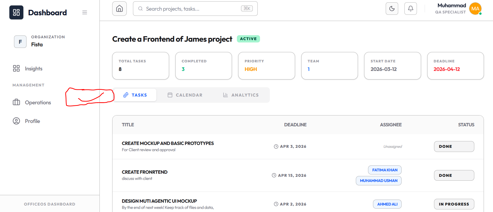
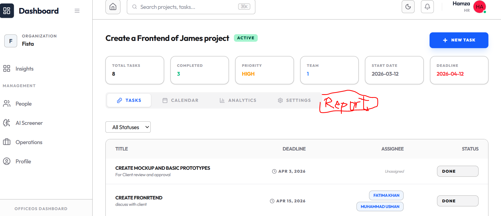
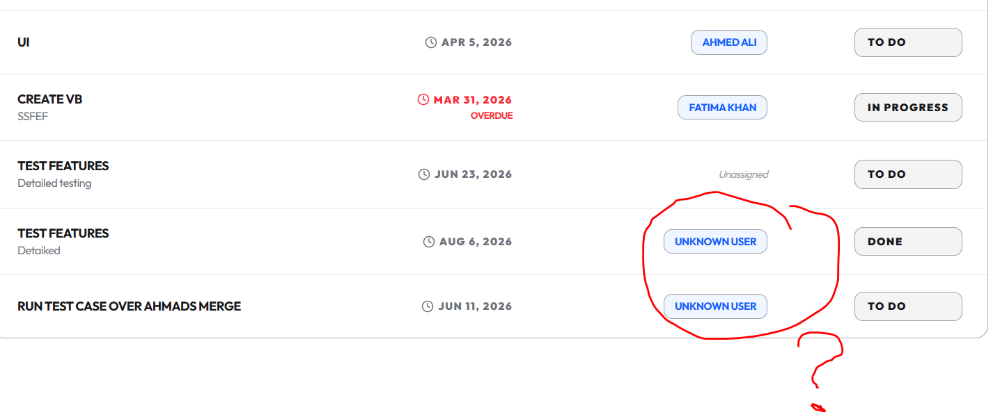

# Roles based access control and feature 
 
# Employee Ui for project task
## 1
 for Emplyee add a button here
 create a button here  name  my tasks ( will open my task page showing his task only)

## 2
- also create a page my task page will have all the task assigned to him and will 
    - share report to HR inform of google doc link
    - button to share report to HR
 
# HR UI for project task
## 1
- create a button here Task reports will open (report page)
- 
## 2
- create a page task report page will have all the task reports of all the employees and will have filter for task status
- Tasks will be shown as slots
- the task report will be shown in a table with columns: task title, task description, task status, task due date, task assigned to, task report uploaded by the employee

## 3
- can be change by the HR
- the task status will be shown as abstract in the table
- employee can only update his task status but can mark it as done .. It will be mark as done when Hr approve it and that will be shown as abstract in the table

## Manage friction less system states no missing data in tables or cards
- e.g  from employee side
- this is not good UI for employee

